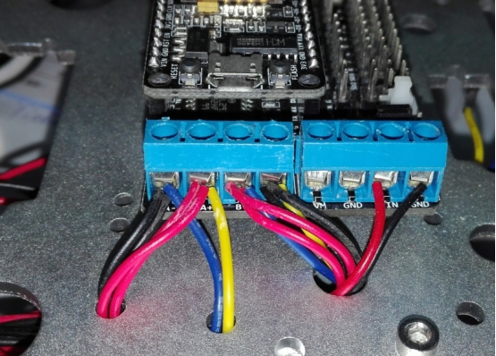

 

 

 

**2代WiFi智能小车使用说明书**

 

 

 

 

 

 

 

 

 

 

**
**

# ***\*0 引言\****

本文档主要讲述了通过手机软件APP和微信来控制小车的前进、后退与停止。同时，也详细说明了ESP8266开发板的网络环境配置方法。该应用可以拓展到物联网中其他多种应用，如三色灯控制，家电控制，以及智能浇花系统等，非常适合于物联网开发者、高校毕业设计及广大爱好者。具体细节请关注**四博智联官网**www.doit.am.

## 大致使用方法

一）使用方法：
- 1）安装app，目前仅支持Android手机；
- 2）默认已经下载了固件，如果没有下载固件，请参考论坛方法下载固件。http://bbs.doit.am/forum.php?mod=forumdisplay&fid=36
- 3）打开手机的WiFi，找到以doit开头的WiFi信号，并连接。
- 4）打开app，
- 5）非常关键！！！！  不用注册账号，直接点击“本地连接”，
- 6）此时可以控制小车了。

二）注意事项
- 1）电机驱动板需要短路连接，如果没有跳线帽，就用2根线连接；
- 2）注意最上面的nodemcu控制板的天线顺序，要与控制板的天线顺序一致；
- 3）电源连接：按图只连接VM和GND。
- 4）电机连接：A+,A-连一个电机；B+B-连接另外一个电机

三）哪里购买
https://szdoit.taobao.com/，店铺内搜索 nodemcu

四）下载
[百度网盘](链接：https://pan.baidu.com/s/1BWzV3Np0kPA1jHdWsDcSZQ) 
提取码：doit 

##详情如下。

# ***\*1 准备工作\****

主要是准备该应用所需的物品，均可在**深圳四博智联**的淘宝商城（https://szdoit.taobao.com/）中购的。

（1）ESP8266开发板

 

**图1 ESP8266开发板**

（2）电机扩展板

 

**图2 电机扩展板**

或者上述两项产品也可以直接购买ESP8266开发板套件。

 

**图3 ESP8266开发板套件**

（3）小车底盘

 

**图4 T300坦克底盘**

（4）其他

主要包括电池，电池盒，导线，螺丝等配件。

（5）安装ESP8266开发板套件

ESP8266开发板套件主要有2块板子：NodeMCU+电机扩展板。默认情况下，2块板子的电源是短路连接的。也即一起供电。但是，**请千万注意：**

1） **NodeMCU的最大电压是9V，而电机扩展板的电压是36V。所以，如果对电机电压有超过9V的需求，请务必分开接电源。**

2） 在短路情况下，套件的连接方法如下图所示。电机1的连接线，电机2的连接，和电源电压的连接。其中，VM是指电机的电源，VIN是NodeMCU的电源。

3） NodeMCU套件不要直接放在小车的金属板上，需要有4个短的铜柱隔离，不然套件容易短路而被烧毁。

 

**ESP8266电机扩展板电机接线图**

附，如果是我们的电机，各连接线的说明如下图所示。VM,GM是电机的电源电压，V,G是码盘传感器的电源电压，S1，S2分别是码盘2个霍尔传感器的输出信号，主要用于反馈。

 

 

 

图 4驱连接示意图

 

 

图 4驱连接实物图

 

（6）安装手机APP软件

点击此处下载nodemcu无线小车固件和对应的App程序。

https://gitee.com/gitnova-cn/robot-documents/commit/baf2791052dbe343e5c6465425bf4c5ceeb256a9

[百度网盘](链接：https://pan.baidu.com/s/1f0nVYdQRLgTka7IS0Tb-eg)
提取码：4ch0 

# ***\*2 小车控制\****

为了使用户能在当地WiFi网络环境中可以控制小车前进，后退，左右之前，需对ESP8266开发板进行网络设置。

**强烈建议：**

1） 对于新手或者不熟悉者，请直接从2.3小节（用APP控制小车开始，特别是2.3.1小节，使点对点的小车控制可以运行，然后再考虑其他的控制方式）；

2） 默认情况下，套件是已经下载了小车固件（控制程序）的，但有时候可能没有下载。如何判别：如果手机检测到WiFi信号的名字中含有doit字样，则说明已经下载程序，否则，没有下载。若没有下载程序，请参考以下链接下载固件。

http://bbs.doit.am/forum.php?mod=viewthread&tid=208&extra=page%3D1

## **手机APP控制小车**

 

**图12 APP界面**

 

在这个APP界面中，主要包括了3种手机控制小车的方法。

### ***\*本地模式（点对点）\****

采用这种点对点（即手机对ESP8266开发板）的方法比较简单。首先在给小车供电，车体上的ESP8266开发板会产生一个名为Doit_ESP_####的WiFi信号，点击并使手机连接此WiFi信号。

 

**图13 点对点通信示意图**

 

然后点击本地模式，出现连接成功的画面后即可控制小车。

 

**图14 手机APP连接成功**

 

这种方法不需要2.1节中的提到的网络配置。只需以下步骤：

1） 下载并安装手机APP DoitcarV2.apk；

2） 查找并连接ESP8266开发板的WiFi信号Doit_ESP_####;

3） 打开APP，**点击本地模式，即可控制小车。**

# ***\*4 要点与总结\****

1）在对ESP8266开发板配置时，最好选择电脑配置；

2）大体上有2种控制小车的方法：远程（互联网）模式和本地模式。其中本地模式又包含2种方式：点对点和本地局域网（即通过WiFi路由器中转通信）；

3）网络环境的配置方法有多种，包括web页面配置、ESPTouch法、手工配置和微信配置，其中web页面配置和手工配置更为简单；

4）若要通过互联网远程控制小车，必须按照2.3.3小节的方法操作。

5）需要通过网络控制小车时，必须通过3）的配置方法来对ESP8266开发板的网络进行设置；

6）虽然电机扩展板的电压可以是36V，但是ESP8266控制板的电压是9V。默认是采用短路子将2块板子短路供电。切记电压勿过高，以免烧毁ESP8266开发板。

# ***\*5 技术支持与服务\****

购买地址：

​	

Doit官方淘宝商城：https://szdoit.taobao.com/

 

 
