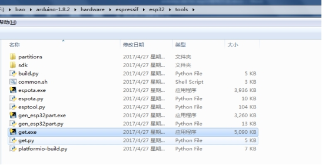
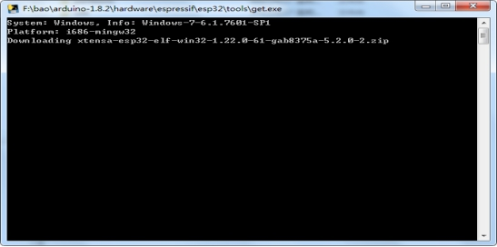
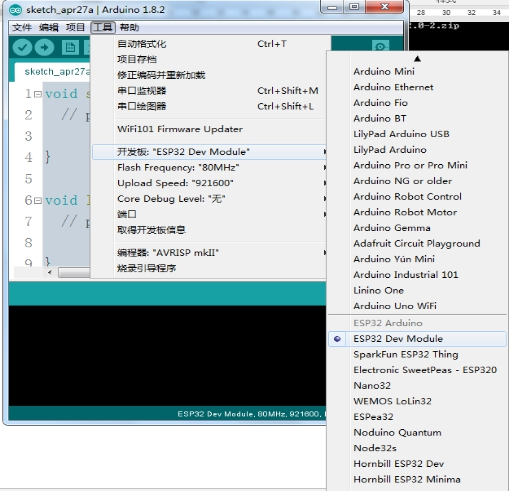
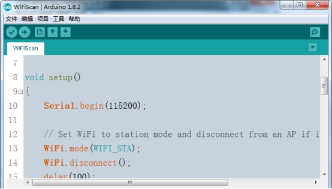
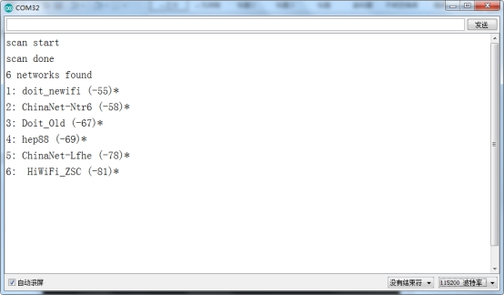

  Arduino IDE搭建esp32开发环境 

 from SZDOIT 

ESP32原理图及使用手册：[点击查看](https://gitee.com/gitnova-cn/documents/commit/0f0bbb3d14a94099e06c93de8c10d1a0f98ae7ac)

## 一、开发环境搭建

### （一）使用windows环境开发，安装步骤：

#### 1． 安装Arduino IDE 

- 可以从[arduino.cc](https://www.arduino.cc/en/Main/Software) 下载Arduino IDE客户端。

#### 2． 安装Git GUI

- 可以从[git-scm.com](https://git-scm.com/download/win) 下载Git GUI客户端。

#### 3． 打开Git GUI 选择Clone Existing Repository

在Source Location选项键入https://github.com/espressif/arduino-esp32.git

在Target Directory选项点击Browse选择Arduino IDE目录下的/hardware文件夹

然后在文件路径后面添加/espressif/esp32。其实就是创建一个文件夹，但是不能自己先创建，需要用软件里填写创建。

以我现在的路径为例，Target Directory选项完整路径为F:/bao/arduino-1.8.2/hardware/espressif/esp32

 

#### 4． 点击Clone，等待安装完成

 

#### 5． 安装完成

 

#### 6点击.打开刚才定义的目录下的tools文件夹，点击get.exe，开始下载库文件

 

 

#### 7. 下载完成后打开Arduino IDE可以看到板卡中已经可以选择ESP 32开发板

 

#### 8.板卡选择ESP32 Dev Modeule，打开示例的WiFi Scan 点击上传

 

显示下载完成

 

打开串口助手即可看到扫描到的wifi信息了

更多详情请参见https://github.com/espressif/arduino-esp32

## 更多资源，请关注公众号！

