 

 

 

 

 

 

 

 

****WiFi-TTL透传固件****

 

****使用手册****

 

 

 

 

 

 

 

 

**
**

****
****

 

****文档更新说明****

 

 

| 日期      | 版本 | 更新内容 |
| --------- | ---- | -------- |
| 2017-3-31 | V1.0 | 首次发布 |

 

****
****

 

 

****目****   ****录****

 

[一. 固件特色	](#_Toc478742105)

[二 网页配置使用说明	](#_Toc478742106)

[2.1 查看状态	](#_Toc478742107)

[2.2 串口配置	](#_Toc478742108)

[2.3 WiFi配置	](#_Toc478742109)

[2.4 网络配置	](#_Toc478742110)

[2.5 重启模块	](#_Toc478742111)

[2.6 恢复出厂设置	](#_Toc478742112)

[2.7 查看版本号	](#_Toc478742113)

[2.8 内置AT指令集	](#_Toc478742114)

[三 LED灯含义	](#_Toc478742115)

[四 配置案例	](#_Toc478742116)

[4.1 局域网透传	](#_Toc478742117)

[4.2 基于Doit云远程透传	](#_Toc478742118)

[附录. 设计资料	](#_Toc478742119)

 

****图目录****

 

[图2. 1默认热点	](#_Toc478742465)

[图2. 2热点信息	](#_Toc478742466)

[图2. 3模块运行状态	](#_Toc478742467)

[图2. 4模块在STA下连接成功的状态	](#_Toc478742468)

[图2. 5 MODULE菜单	](#_Toc478742469)

[图2. 6 MORE菜单	](#_Toc478742470)

[图2. 7 串口设置页面	](#_Toc478742471)

[图2. 8 保存设置失败页面	](#_Toc478742472)

[图2. 9 保存设置成功页面	](#_Toc478742473)

[图2. 10 WiFi设置界面-AP模式	](#_Toc478742474)

[图2. 11 WiFi设置界面-STA模式	](#_Toc478742475)

[图2. 12网络设置	](#_Toc478742476)

[图2. 13重启模块页面	](#_Toc478742477)

[图2. 14恢复出厂页面	](#_Toc478742478)

[图2. 15查看版本号页面	](#_Toc478742479)

[图2. 16 AT+STASTATUS示例	](#_Toc478742480)

[图2. 17 AT+RST示例	](#_Toc478742481)

[图4. 1案例实物照片	](#_Toc478742177)

[图4. 2案例-连接WiFi模块热点	](#_Toc478742178)

[图4. 3TCP Client设置	](#_Toc478742179)

[图4. 4透传示例	](#_Toc478742180)

[图4. 5打开Doit透传云	](#_Toc478742181)

[图4. 6手机端网络调试助手	](#_Toc478742182)

[图4. 7案例-STA模式设置	](#_Toc478742183)

[图4. 8案例-STA模式设置保存参数	](#_Toc478742184)

[图4. 9案例-网络设置	](#_Toc478742185)

[图4. 10案例-串口收到数据	](#_Toc478742186)

[图4. 11案例-APP收到数据	](#_Toc478742187)

 

****表目录****

[表2. 1内置AT指令集	](#_Toc478743169)

[表3. 1 LED灯含义	](#_Toc478742165)

 

 

 

**
**

# ****一. 固件特色****

***抛开繁琐AT指令，简单Web页面配置，即可实现透传。***

WiFi-TTL透传固件是深圳四博智联科技有限公司基于乐鑫ESP8266 RTOS SDK开发，实现了模块串口与WiFi数据的实时无缝透传。经过我司前几个透传版本技术沉淀，在固件功能性、稳定性上都有长足进步。本次固件大幅度优化了串口接收和发送性能，特别设计了WiFi STA模式下重连机制、TCP Client模式下重连机制，保证数据链路的稳定连接传输。

透传固件优化了网页配置界面，支持AP、STA、AP+STA配置方式，支持的串口波特率从300bps~3686400bps，支持TCP Server/Client，UDP Server/Client，UDP局域网广播等多种功能。同时保留了原2.4.1版本的AT指令，是目前市面上ESP8266/ESP8285最佳透传固件之一。

固件特性如下：

l 串口与WiFi数据实时无缝透传；

l 内置HTTP Web Server，支持网页配置各项参数；

l WiFi支持AP、STA、AP+STA三种模式；

l 支持WiFi STA模式下自动重连，TCP Client模式下自动重连；

l 串口支持设置波特率、数据位、奇偶校验、停止位、分包时间；

l 支持波特率(bps)：300/600/1200/2400/4800/9600/19200/38400/57600/74800/115200/

230400/460800/921600/1843200/3686400；

l 支持AP使能、自定义SSID/密码、自定义IP和网段等；

l 自动扫描周边热点，支持STA使能、DHCP、自定义IP和网段等；

l 支持TCP Server、TCP Client、UDP Server、UDP Client和UDP局域网广播；

l 远程服务器地址支持DNS域名自动解析；

l 支持通过AT指令查看状态；

l 引出IO4表征WiFi状态。

 

# ****二 网页配置使用说明****

本固件内置HTTP Server，可以通过PC机或者智能终端的浏览器进行配置，无需其他配置工具或者APP。在出厂设置中，固件默认工作在AP模式，WiFi模块主动发出来的热点名称为：“Doit_WiFi_xxxxxx”，其中“xxxxxx”是该模块的MAC地址后六位。可以使用带无线网卡的PC机或者智能手机/平板（支持Android和IOS、Windows Phone等）连接该热点。热点无密码。

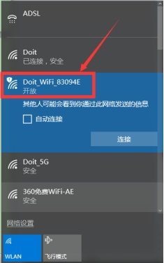 

图2. 1默认热点

连接成功后，使用浏览器输入IP地址：“192.168.4.1”。

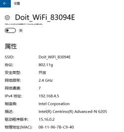 

图2. 2热点信息

打开配置页面进行配置，详见如下。

## ****2.1 查看状态****

默认情况下，打开浏览器输入“192.168.4.1”，会进入状态页面。

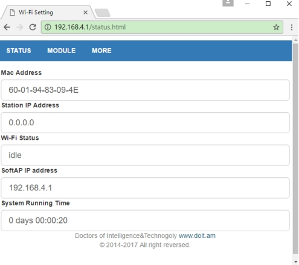 

图2. 3模块运行状态

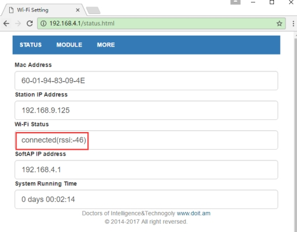 

图2. 4模块在STA下连接成功的状态

在状态页面中，显示了本模块的MAC地址、STA模式下的IP地址、WiFi连接状态、AP模式下的IP地址、系统运行时间等信息。其中：

“Wi-Fi Status”：显示的值有：“idle”、“connecting”、“wrong password”、“no ap found”、“connect failed”、“connected(rssi:xxx)”。若STA连接成功，会显示当前连接的信号强度（rssi值，该值为负数）。

“System Running Time”：显示系统运行时间。

在“MODULE”和“MORE”下有二级菜单。可进行更多设置。

 

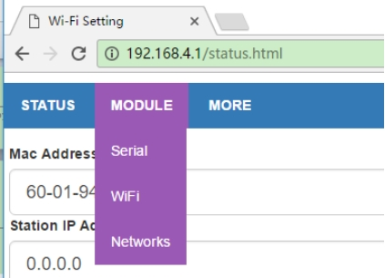 

图2. 5 MODULE菜单

 

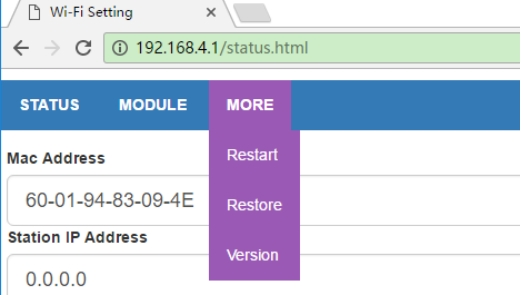 

图2. 6 MORE菜单

## ****2.2 串口配置****

在串口设置页面可以设置串口的波特率、数据位数、奇偶校验位、停止位等，同时可以设置串口的分包时间间隔。

l 可设置串口波特率：300/600/1200/2400/4800/9600/19200/38400/57600/74800/115200/230400/460800/921600/1843200/3686400

l 数据位：5/6/7/8

l 校验位：NONE/ODD/EVEN

l 停止位：1/1.5/2

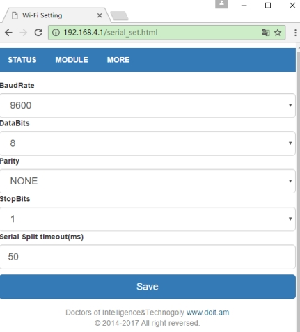 

图2. 7 串口设置页面

设置完成后，使用“Save”按钮保存设置。若保存参数有误，将会提示保存失败。否则提示保存成功。注意：保存设置成功后，需要重启WiFi模块，参数方能生效。

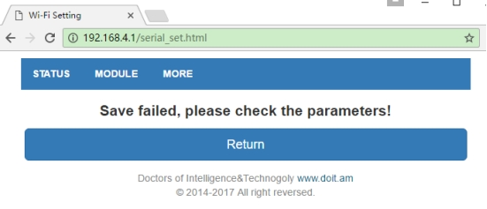 

图2. 8 保存设置失败页面

 

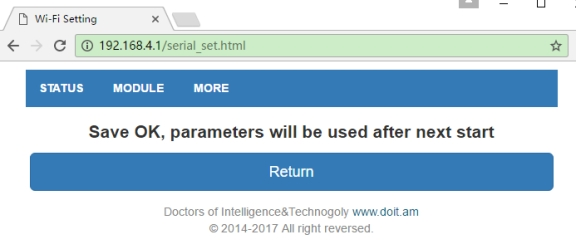 

图2. 9 保存设置成功页面

 

后续页面设置与此类似，不再累述。

## ****2.3 WiFi配置****

WiFi可设置模块工作在AP、STA、AP+STA模式。

AP设置：

l 可打开或关闭AP模式

l 自定义AP的SSID名称和密码。若密码留空，这表示不加密；否则使用WEP加密方式。**注意：WiFi密码需要设置8~63个字符。不可多也不能少。**

l 自定义AP模式下WiFi模块的IP地址、子网掩码、网关地址等。注意：WiFi模块在AP模式下的IP地址、子网掩码、网关地址与其在STA模式下的IP地址、子网掩码、网关地址不可以在同一个地址段。例如AP模式下IP地址为192.168.4.1，则该模块在STA模式下的IP地址不能够为192.168.4.X，否则不能正常工作。

STA设置：

可打开或关闭STA模式

l 当打开WiFI配置页面时，WiFi模块会自动扫描周边热点，并显示在SSID List下拉列表框中，供选择。

l 设置将要连接的无线路由器SSID和密码。

l 是否启动DHCP功能，若启用，不用指定IP、子网掩码、网关地址，否则需要指定。注意：WiFi模块在AP模式下的IP地址、子网掩码、网关地址与其在STA模式下的IP地址、子网掩码、网关地址不可以在同一个地址段。例如AP模式下IP地址为192.168.4.1，则该模块在STA模式下的IP地址不能够为192.168.4.X，否则不能正常工作。

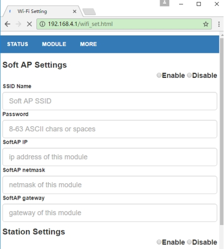 

图2. 10 WiFi设置界面-AP模式

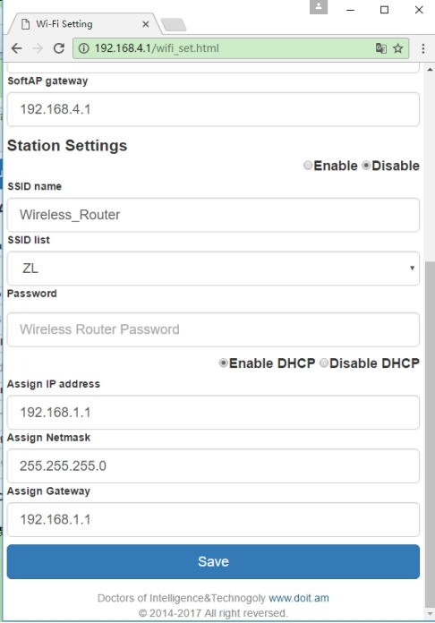 

图2. 11 WiFi设置界面-STA模式

## ****2.4 网络配置****

在网络配置界面可以设置WiFi模块的网络工作模式。可选的工作模式有：TCP服务器/客户端、UDP服务器/客户端、UDP广播等。

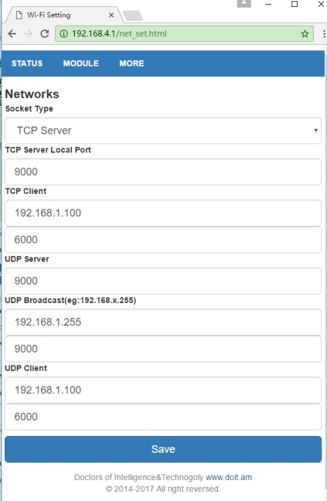 

图2. 12网络设置

其中：

l 当选择TCP/UDP Client时，远程服务器的IP地址支持动态域名，固件会自动根据域名获得IP地址；

l UDP广播模式支持在局域网内的广播，填写规则是：192.168.x.255，其中“x”是模块在STA模式下获得的IP地址段号。

## ****2.5 重启模块****

重启模块页面如下。

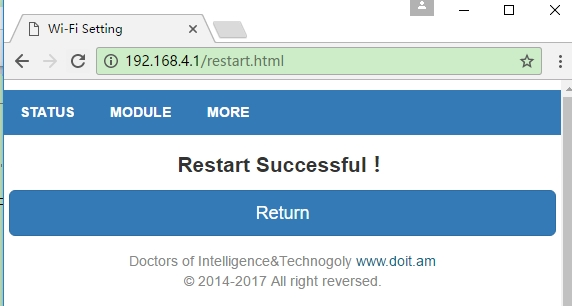 

图2. 13重启模块页面

## ****2.6 恢复出厂设置****

恢复出厂设置页面如下。

出厂参数为：固件关闭STA，工作在AP模式下，IP地址为192.168.4.1；串口参数为9600，n，8，1，分包时间为50ms。网络设置为：TCP Server，监听端口为9000。

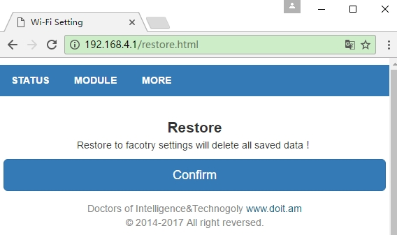 

图2. 14恢复出厂页面

## ****2.7 查看版本号****

查看版本号页面如下，可看到软件版本，硬件支持版本，四博智联的QQ技术支持群等信息。

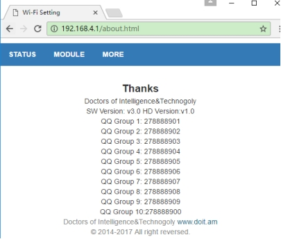 

图2. 15查看版本号页面

## ****2.8 内置AT指令集****

固件内置串口指令，用于获取WiFi模块的当前状态、恢复参数等。具体指令如下所示。

表2. 1内置AT指令集

| 数据方向                     | 指令（ASCII字符串）                      | 含义                                           |
| ---------------------------- | ---------------------------------------- | ---------------------------------------------- |
| STA状态查询                  |                                          |                                                |
| MCU->WiFi模块                | AT+STASTATUS                             | 查询sta模式状态                                |
| WiFi模块->MCU                | STA:OK                                   | WiFi模块回复STA连接成功                        |
| WiFi模块->MCU                | STA:DOWN                                 | WiFi模块回复STA连接关闭                        |
| 获取STA模式的IP和mac         |                                          |                                                |
| MCU-> WiFi模块               | AT+STAINFO                               | 获取WiFi模块mac和ip                            |
| WiFi模块->MCU                | Mac\|IP, 例如5CCF7F116380\|192.168.1.125 | STA模式下MAC地址和IP地址                       |
| 查询TCP Client模式下连接状态 |                                          |                                                |
| MCU-> WiFi模块               | AT+TCPCLIENT                             | 查询TCP Client模式下连接状态，其他模式下无意义 |
| WiFi模块->MCU                | TCP:OK                                   | TCP client已经连接                             |
| WiFi模块->MCU                | TCP:OFF                                  | TCP client断开连接                             |
| 重启模块                     |                                          |                                                |
| MCU->ESP8266                 | AT+RST                                   | 重启wifi模块                                   |
| ESP8266->MCU                 | RST:OK                                   | 收到指令立刻回应                               |
| 恢复出厂设置                 |                                          |                                                |
| MCU->ESP8266                 | AT+RESTORE                               | WiFi模块恢复出厂设置，立刻重启                 |
| ESP8266->MCU                 | RESTORE:OK                               | 收到指令立刻回应                               |

使用示例如下：

1）用USB-TTL模块连接WiFi-TTL模块，在电脑上打开对应的串口，用RST键重启开发板。

2）发送指令“AT+STASTATUS”检查STA是否连接上。

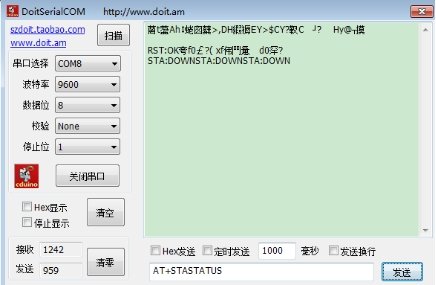 

图2. 16 AT+STASTATUS示例

3）使用指令重启模块：AT+RST

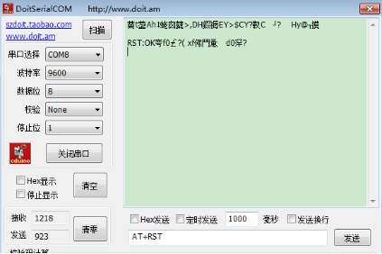 

图2. 17 AT+RST示例

# ****三**** ****LED灯含义****

固件控制WiFi模块的GPIO4管脚，用于指示WiFi状态。在WiFi-TTL模块注1中，GPIO4管脚同时连接板载LED以及STATE管脚。WiFi状态含义如下。

 

表3. 1 LED灯含义

| 序 号 | LED灯指示 | 功能说明                                                     |
| ----- | --------- | ------------------------------------------------------------ |
| 1     | 常亮      | WiFi模块在STA或者STA+AP模式下，成功连接到无线路由器          |
| 2     | 慢闪      | IO口电平1秒钟变化一次；WiFi模块没有成功连接无线路由器；WiFi模块工作在AP模式下；WiFi模块工作是STA模式下，正在尝试连接无线路由器；WiFi模块工作是AP+STA模式下，正在尝试连接无线路由器； |
| 3     | 快闪      | 当按住SW1/Flash按键的时候；当串口收到数据，或者网络收到数据转发到串口，LED灯会快速闪烁； |
| 4     | 常灭      | WiFi模块没有工作，可能供电不正常，非透传固件                 |

注1：关于WiFi-TTL模块的产品手册可参考我司手册：《DBH011CN_WiFi-TTL模块产品手册(Vx.x).pdf》

# ****四 配置案例****

本节以两个具体配置案例说明固件使用方法。以WiFi-TTL模块外接USB-TTL模块为例。USB-TTL模块连接到PC的USB口。

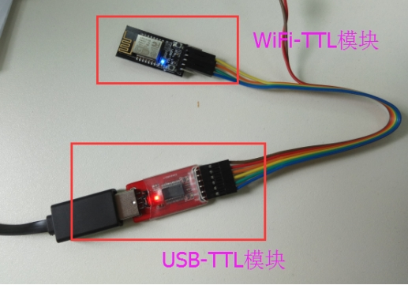 

图4. 1案例实物照片

## ****4.1 局域网透传****

本案例以默认出厂设置为例，实现WiFi模块串口数据到PC机之间的透传。

在默认出厂情况下，固件关闭STA，工作在AP模式下，串口参数为9600，n，8，1。网络设置为：TCP Server，监听端口为9000。

1）使用PC机连接热点“Doit_WiFi_xxxxxx”，“xxxxxx”为WiFi模块MAC地址，此处为“83094E”。

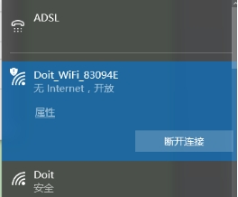 

图4. 2案例-连接WiFi模块热点

2）使用TCP Debug工具创建一个TCP Client客户端，连接到“192.168.4.1”的“9003”端口。同时打开一个串口调试工具，例如DoitSerialCOM，连接USB-TTL模块，设置串口参数为9600，n，8，1。即可实现串口数据到网络数据的透传。

 

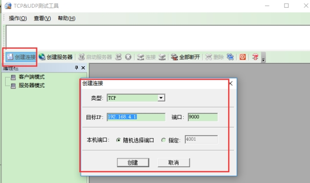 

 

图4. 3TCP Client设置

 

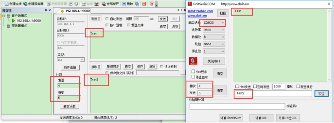 

 

图4. 4透传示例

## ****4.2 基于Doit云远程透传**** 

本案例利用Doit透传云，实现WiFi模块串口与手机端APP的远程数据传输。

1）在PC机上用浏览器打开“tcp.doit.am”，获取Doit透传云的ip和端口，页面有透传云详细使用方法。如下图所示。获得一个临时可用的IP和端口，例如：“115.29.109.104”，端口是“6524”。

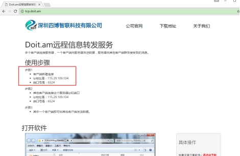 

图4. 5打开Doit透传云

2）在安卓手机上安装一个网络调试助手工具，并使用TCP Client连接到“115.29.109.104”，端口是“6524”。在此过程中，保证安卓手机能够正常连接外网。例如如下图所示，采用4G网络。

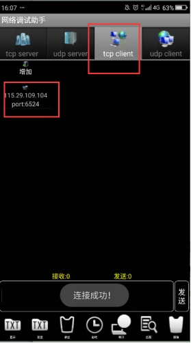 

图4. 6手机端网络调试助手

 

3）WiFi模块通过USB-TTL模块连接到PC端，上电。

首先，在出厂设置参数下，连接WiFi模块热点，进入WiFi配置页面。设置WiFi模块工作在STA模式，并输入无线路由器的SSID和密码，提交保存。本例中STA选择“Enable”，SSID Name填“Doit”，密码为“doit3305”，其他参数默认即可。

其次，进入到网络配置页面，选择TCP Client，在IP和端口位置填写：“115.29.109.104”和“6524”。

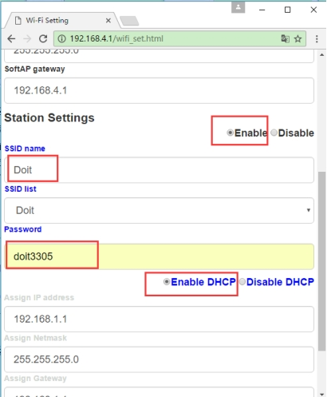 

图4. 7案例-STA模式设置

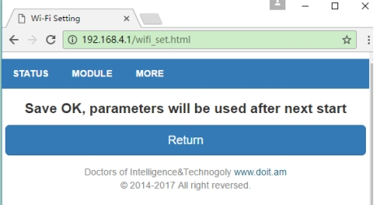 

图4. 8案例-STA模式设置保存参数

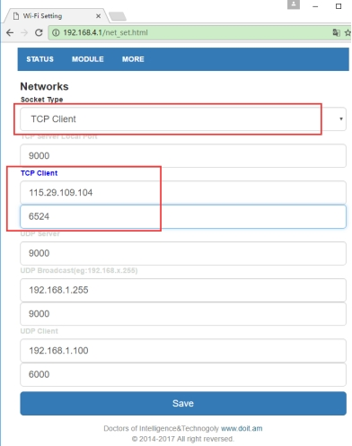 

图4. 9案例-网络设置

4）重启WiFi模块使参数生效，可以实现手机APP与WiFi模块串口数据之间的透传。

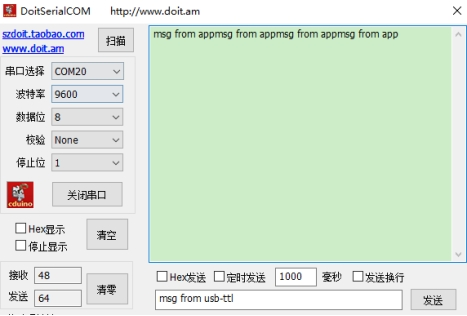 

图4. 10案例-串口收到数据

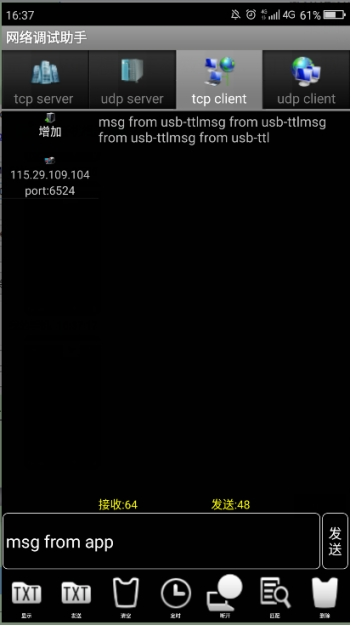 

图4. 11案例-APP收到数据

淘宝购买地址：

https://item.taobao.com/item.htm?spm=a1z10.3-c-s.w4002-23087949821.24.293b5ac1PAwlFS&id=659195539322

 