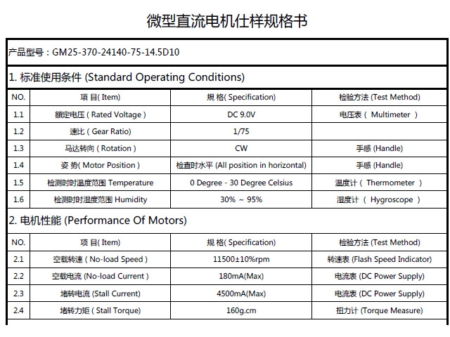
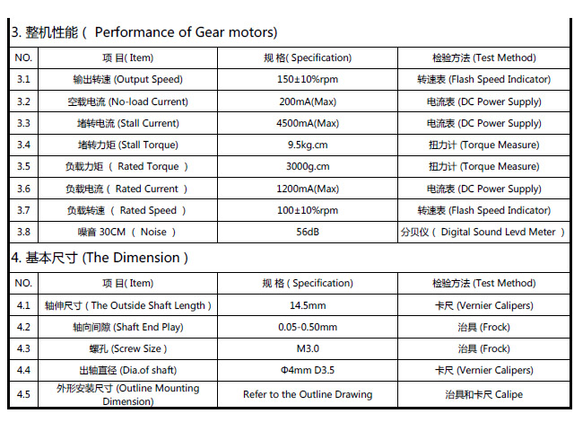
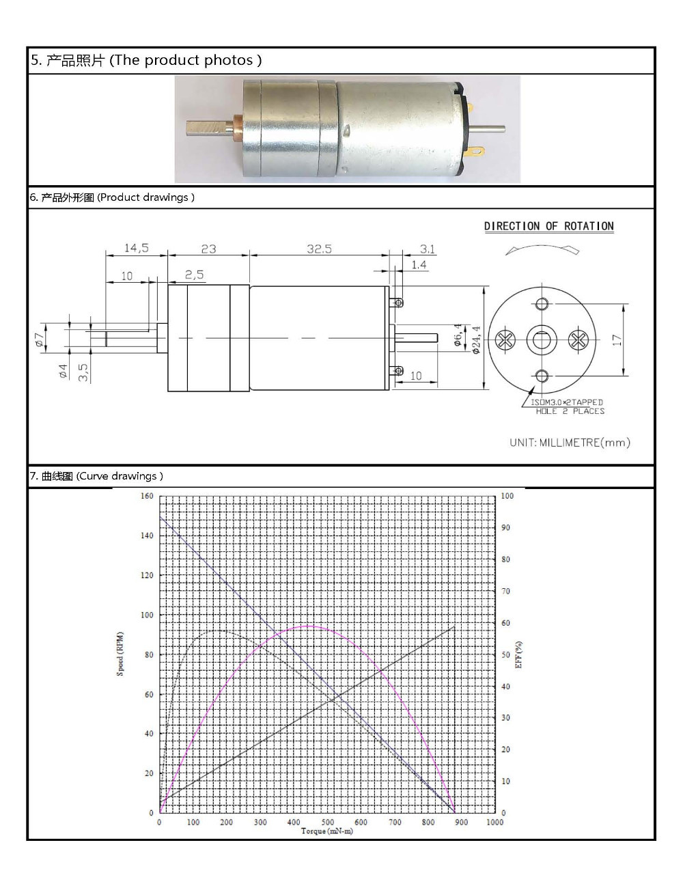
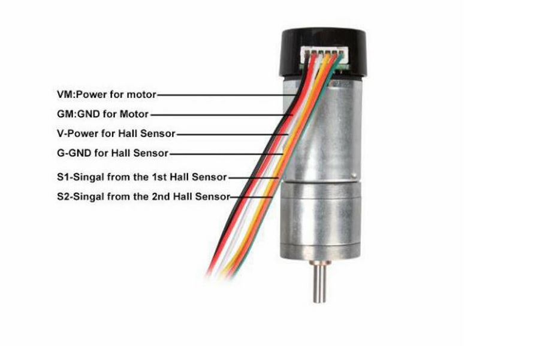
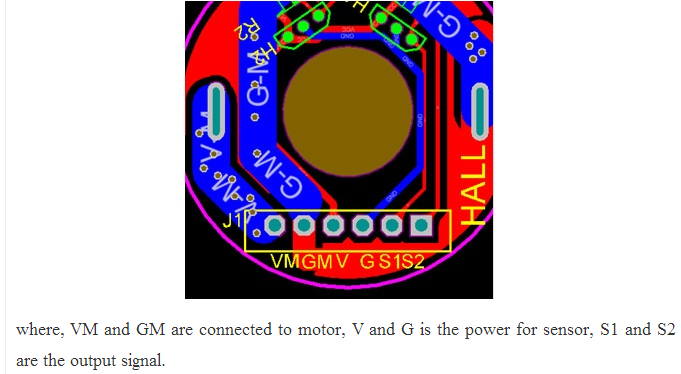
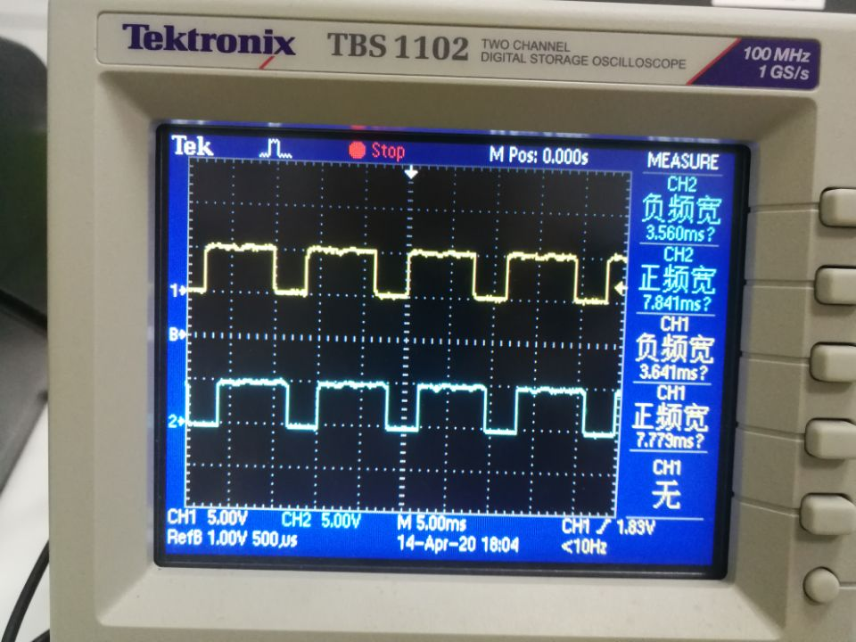
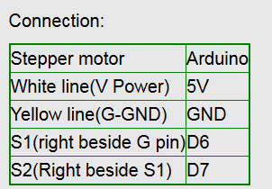
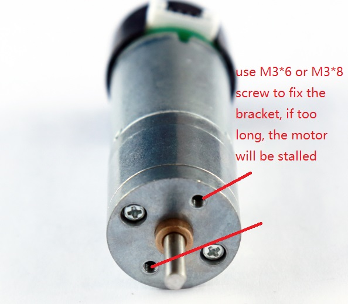

---

# 注释：文件开头使用YAML语法配置文章信息，之后是正常的Markdown语法
# Note: The beginning of the file uses YAML syntax to configure the blog meta data, followed by the normal Markdown syntax.

# 此处如果不配置标题，则提取Markdown中的一级标题，或使用文件名
# Title will be extracted from heading 1 of markdown or using file name if not configured here.
title: 9V DC Motor


# 此处如果不配置摘要，则从正文提取开头若干文字
# Abstract will be extracted from the begining of markdown content if not configured here.
abstract: This manual is for 9v DC motor


# URL用于固定链接、编辑文章功能，建议所有文章都配置
# URL is used for permalink and article editing, and it is recommended to be configured.
url: 9V DC Motor


# 文章发布时间，使用的时区和系统设置一致，不设置则使用当前时间
# Article post time, time zone is the same as the system settings. Current time will be used if not configured here.
date: 


# 文章分类
category:
- Robotics
- Electronics


# 文章标签
tags:
- dc motor
- tank chassis
- engine
- robot
- smart car


---

# 1. 9V 25GA-370 Motor Parameters:

- Name: 25mm DC carbon brush motor (with Hall sensor code disc)
- Output rate: 150 ± 10% rpm
- Load current: 200mA (Max)
- Stall current: 4500mA (max)
- Locking torque: 9.5kgNaN
- Load speed: 100 ± 10% rpm
- Load torque: 3000gNaN
- Load current: 1200mA (Max)
- Load noise: 56dB
- Working voltage: 9V
- Shaft extension size: 14.5mm
- Axial clearance: 0.05-0.50mm
- Screw size: M3.0
- Shaft diameter: phi4mm, D3.5
- Code wheel parameters: 2 pulses / turn
- Sensor working voltage: 3-5V







# 2. Motor Connection

The connection is show in the following picture.



**Hall sensor:**

  This motor has Hall sensor, which can measure the velocity, and give out a feedback. If let the interface (or plug) face to our face, from left to right, the interface meanings are VM (power for motor), GM (grand for motor), V (power for Hall sensor), G (grand for Hall sensor), S1 (the output signal for the 1st Hall sensor), S2 (the output signal for the 2nd Hall sensor)



# How to Test the Motor

There are two methods.

## 3.1 Use Oscilloscope

When power on the motor, and connect to the Hall sensor of motor, you will see the following wave. This way is very simple.



## 3.2 Use Arduino

### 3.2.1 Connect to UNO



### 3.2.2 Test Code

```
/*
 * How to test encoder with Arduino
 * url: http://osoyoo.com/?p=30267
 */
 #define outputA 6
 #define outputB 7
 int counter = 0; 
 int aState;
 int aLastState;  
 void setup() { 
   pinMode (outputA,INPUT);
   pinMode (outputB,INPUT);
   
   Serial.begin (9600);
   // Reads the initial state of the outputA
   aLastState = digitalRead(outputA);   
 } 
 void loop() { 
   aState = digitalRead(outputA); // Reads the "current" state of the outputA
   // If the previous and the current state of the outputA are different, that means a Pulse has occured
   if (aState != aLastState){     
     // If the outputB state is different to the outputA state, that means the encoder is rotating clockwise
     if (digitalRead(outputB) != aState) { 
       counter ++;
     } else {
       counter --;
     }
     Serial.print("Position: ");
     Serial.println(counter);
   } 
   aLastState = aState; // Updates the previous state of the outputA with the current state
 }

```

From the monitor, you can see the output data.

**Very important, when you install the motor to the car chassis, Please choose the M3*6 screw to fix the motor. By our experience, if you choose the screw is too long, the motor would be stalled, and cannot be run.**

